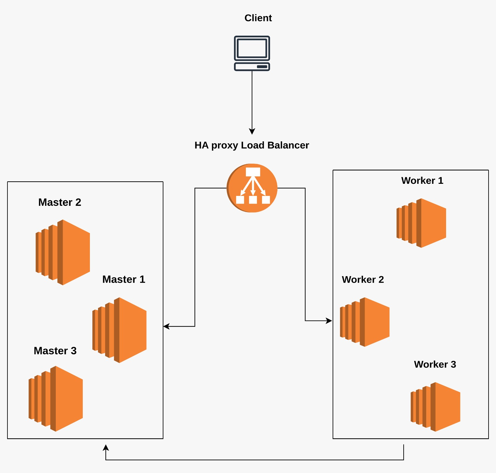
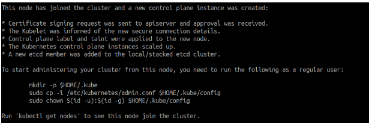
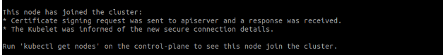
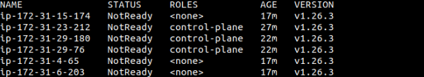
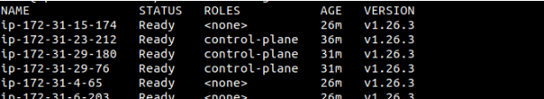

# **Kubernetes Multi-Master High Availability Cluster using Kubeadm**

Kubernetes is a powerful and widely used container orchestration platform. For organizations that depend on Kubernetes to run mission-critical applications, ensuring high availability is essential. By setting up a highly available multi-master Kubernetes cluster with a load balancer, organizations can increase the availability, scalability, and reliability of their Kubernetes clusters. This is achieved by distributing control plane components across multiple nodes, enabling the cluster to withstand failures and adapt to changing workloads. With a highly available Kubernetes cluster, organizations can minimize downtime, improve application performance, and ensure that their applications remain accessible and operational even in the face of unexpected events.



## **Pre-requisites**

- 3 machines for master nodes, ubuntu 16.04+, 2 CPU, 2 GB RAM, 10 GB storage
- 3 machines for worker nodes, ubuntu 16.04+, 1 CPU, 2 GB RAM, 10 GB storage
- 1 machine for load balancer, ubuntu 16.04+, 1 CPU, 2 GB RAM, 10 GB storage
- All machines must be accessible on the network. For cloud users - single VPC for all machines
- **`sudo`** privilege
- **`ssh`** access from load balancer node to all machines (master & worker).

## **Setting Up the Load Balancer**

To set up a load balancer for a highly available Kubernetes cluster, the first step is to choose a load balancer solution that is compatible with Kubernetes, such as HAProxy or NGINX. Next, configure the load balancer to route traffic to the Kubernetes API server endpoints exposed by the master nodes.

Keep in mind that in a Kubernetes multi-master cluster, the load balancer's primary purpose is not to distribute the load across the master nodes, but rather to provide a single IP address that can be used to access the master nodes in a highly available manner. This allows clients to connect to the Kubernetes API server without worrying about which master node is currently active, ensuring that the control plane components are accessible and operational at all times. However, the load balancer will distribute the requests equally among the master nodes, and if an inactive master node gets a request, it would route it to the currently active master node.

I am using HAProxy as my load balancer. Follow the steps to configure it on your machine:

### **Step 1**

Login to the Load Balancer node with the **`sudo`** privilege.

### **Step 2**

Update your system and repository and Install HA proxy.

```

sudo apt-get update && sudo apt-get upgrade -y
sudo apt-get install haproxy -y

```

### **Step 3**

### 


```

nano /etc/haproxy/haproxy.cfg

```

Open the HA proxy configuration file and add the following at the end of the configuration file.


```
frontend fe-apiserver
   bind 0.0.0.0:6443
   mode tcp
   option tcplog
   default_backend be-apiserver

backend be-apiserver
   mode tcp
   option tcplog
   option tcp-check
   balance roundrobin
   default-server inter 10s downinter 5s rise 2 fall 2 slowstart 60
   maxconn 250 maxqueue 256 weight 100

   server master1 <Master1-IP>:6443 check
   server master2 <Master2-IP>:6443 check
   server master3 <Master3-IP>:6443 check

```

The purpose of adding these blocks in the HAProxy configuration file is to define the front-end and back-end configurations for routing and load balancing traffic to the Kubernetes API servers. The "frontend fe-apiserver" block specifies the IP address and port number on which the HAProxy load balancer listens for incoming traffic. The "backend be-apiserver" block defines the configuration for the actual load balancing, including the load balancing algorithm, the health check settings, and the list of servers (in this case, the Kubernetes master nodes) that traffic will be routed to.

Replace the IP addresses and hostnames according to your machines and try to use the private IP as it provides an additional layer of security.

### **Step 4**

Restart and Verify haproxy

```
systemctl restart haproxy
systemctl status haproxy
```

NOTE: You may get an alert that HA proxy server could not connect to any of the master nodes and it is normal at this point because the master nodes are not listening on port 6443 currently. This will change once the master nodes are configured.

### **Step 5**

Run this command to check whether the server is successfully listening to port 6443 or not:

```
nc -v localhost 6443
```

This command should result in the following output:

```
Connection to localhost 6443 port [tcp/*] succeeded!
```

## **Setting Up Masters and Workers.**

The following steps are for the necessary installations on ALL the master and the worker nodes.

### **Step 1**

Update the repositories:

```
apt-get update
```

Turn off swap:

```
swapoff -
```

### **Step 2**

Install kubeadm, kubectl, and kubelet along with the necessary dependencies:

```
sudo apt-get update && sudo apt-get install -y apt-transport-https curl

curl -s https://packages.cloud.google.com/apt/doc/apt-key.gpg | sudo apt-key add -

cat <<EOF | sudo tee /etc/apt/sources.list.d/kubernetes.list
deb https://apt.kubernetes.io/ kubernetes-xenial main
EOF

sudo apt-get update

apt-get install -y kubelet kubeadm kubectl
```

### **Step 3**

Install container runtime:

The Kubernetes version 1.20 marked the deprecation of Docker as a container runtime within a Kubernetes cluster, and its support was completely removed in version 1.22. With the release of Kubernetes 1.26, it has become mandatory to use a container runtime that adheres to the Container Runtime Interface (CRI) standard. In this post-Docker/Kubernetes era, one of the viable options available to you as a container runtime is containerd, which is CRI-compatible and supported by Kubernetes.

```
cat <<EOF | sudo tee /etc/modules-load.d/k8s.conf
overlay
br_netfilter
EOF

sudo modprobe overlay
sudo modprobe br_netfilter

cat <<EOF | sudo tee /etc/sysctl.d/k8s.conf
net.bridge.bridge-nf-call-iptables  = 1
net.bridge.bridge-nf-call-ip6tables = 1
net.ipv4.ip_forward                 = 1
EOF

sudo sysctl --system

curl -fsSL https://download.docker.com/linux/ubuntu/gpg | sudo gpg --dearmor -o /etc/apt/keyrings/docker.gpg

echo "deb [arch=$(dpkg --print-architecture) signed-by=/etc/apt/keyrings/docker.gpg] https://download.docker.com/linux/ubuntu \
$(lsb_release -cs) stable" | sudo tee /etc/apt/sources.list.d/docker.list > /dev/null

sudo apt-get update
sudo apt-get install -y containerd.io

sudo mkdir -p /etc/containerd

sudo containerd config default | sudo tee /etc/containerd/config.toml

nano /etc/containerd/config.toml
```

Search for the **`SystemdCgroup`** in **`[plugins."io.containerd.grpc.v1.cri".containerd.runtimes.runc.options]`** section and set its value to **`true`**.

```
[plugins."io.containerd.grpc.v1.cri".containerd.runtimes.runc.options]
SystemdCgroup = true
```

```
sudo systemctl restart containerd
systemctl daemon-reload
```

# **Configuring the Master Nodes**

These commands will now only be run on any one of the three master nodes to make that node the master node.

```
kubeadm init --control-plane-endpoint "LOAD_BALANCER_DNS:LOAD_BALANCER_PORT" --upload-certs --pod-network-cidr=192.168.0.0/16
```

This command initializes a Kubernetes control plane and sets the load balancer's DNS name and port as the control plane endpoint. It also uploads the necessary certificates and sets the pod network CIDR range to 192.168.0.0/16.

The output of this command will give you three important blocks of commands. Something like this:

1. To make the **`.kube`** directory and copy the configuration file:
    
    ```
    mkdir -p $HOME/.kube
    sudo cp -i /etc/kubernetes/admin.conf $HOME/.kube/config
    sudo chown $(id -u):$(id -g) $HOME/.kube/config
    ```
    

2. To join the control-plane node:
    
    ```
    kubeadm join loadbalancer:6443 --token cnslau.kd5fjt96jeuzymzb \
    --discovery-token-ca-cert-hash sha256:871ab3f050bc9790c977daee9e44cf52e15ee37ab9834567333b939458a5bfb5 \
    --control-plane --certificate-key 824d9a0e173a810416b4bca7038fb33b616108c17abcbc5eaef8651f11e3d146
    ```
    
    Please note that the certificate-key gives access to cluster sensitive data, keep it secret! As a safeguard, uploaded-certs will be deleted in two hours; if necessary, you can use **`kubeadm init phase upload-certs --upload-certs`** to reload certs afterward.
    
3. To join the worker nodes:
    
    ```
    kubeadm join loadbalancer:6443 --token cnslau.kd5fjt96jeuzymzb \
    --discovery-token-ca-cert-hash sha256:871ab3f050bc9790c977daee9e44cf52e15ee37ab9834567333b939458a5bfb5
    ```
    

Copy the command number 2 (from your output) and run that command on the two other master nodes. By doing so, those nodes will join the cluster as control plane nodes and will be accessible by the control plane IP. Your output should look something like this on both the nodes.





# **Configuring the Worker Nodes**

To add worker nodes to the cluster, copy command number 3 from the output on the master 1 node:

```
kubeadm join loadbalancer:6443 --token cnslau.kd5fjt96jeuzymzb \
    --discovery-token-ca-cert-hash sha256:871ab3f050bc9790c977daee9e44cf52e15ee37ab9834567333b939458a5bfb5
```



After running this command on each worker node, return to all the master nodes and execute the following commands:

```
mkdir -p $HOME/.kube
sudo cp -i /etc/kubernetes/admin.conf $HOME/.kube/config
sudo chown $(id -u):$(id -g) $HOME/.kube/config
```

This sets up the **`kubectl`** command-line tool to communicate with the Kubernetes cluster by using the configuration file at **`$HOME/.kube/config`**.

Once you've configured the master and worker nodes, the next step is to set up the Kubeconfig (**`$HOME/.kube`**) on the load balancer node. You can either set it up on the load balancer node or on an external machine that has access to the load balancer node. In this demo, the load balancer node will host both kubeconfig and kubectl.

To configure the load balancer node, log in to the Load Balancer server and execute the following commands:

```
mkdir -p $HOME/.kube
scp master1:/etc/kubernetes/admin.conf $HOME/.kube/config
chown $(id -u):$(id -g) $HOME/.kube/config
```

This copies the configuration file from any one master node to the load balancer. Note that you need to be able to ssh into that master node from inside the load balancer to perform this step.

Then install the kubectl binary:

```
snap install kubectl --classic
```

To verify the cluster, run the following command on the load balancer:

```
kubectl get nodes
```



Note that the status of all the nodes will be 'NotReady'. To turn the status to 'Ready', you need to install CNI on the load balancer using the following command:

```
kubectl apply -f https://docs.tigera.io/archive/v3.25/manifests/calico.yaml
```

The v3.25 is the latest version currently. Make sure to use the latest version.

Wait for a few seconds and run **`kubectl get nodes`** again to verify the status of the nodes.



Now any command you run on the load balancer or any another remote client using kubectl , load balancer’s IP and the configuration file, will be load balanced among the master nodes and would be processed by the active master only.If one master goes down, one among the rest of the two will become the active master , thus , ensuring High availability and sustainable environment.
